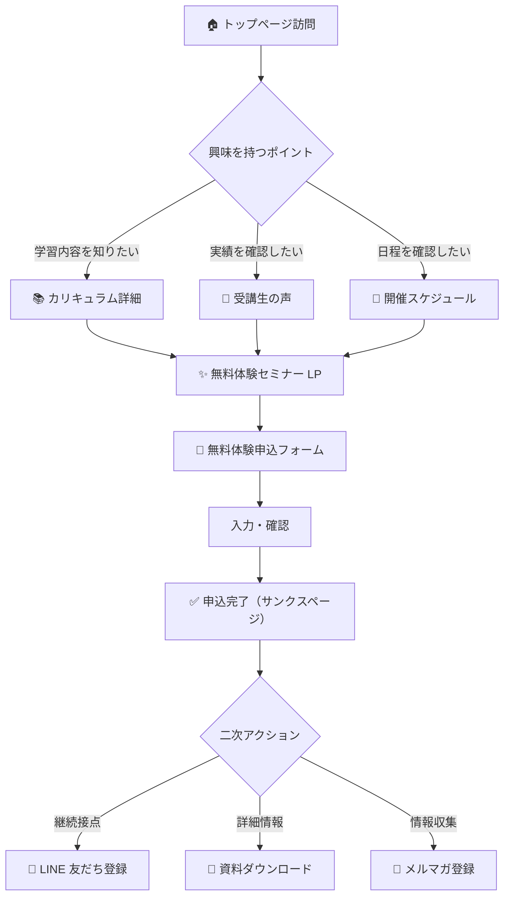

# 株式投資スクール Web サイト 情報設計・サイトマップ

**作成日：2025 年 10 月 31 日**  
**バージョン：1.0**  
**ステータス：初版ドラフト**  
**前提文書：要件定義.md**

---

## 📋 プロジェクト概要

| 項目             | 内容                                                                    |
| ---------------- | ----------------------------------------------------------------------- |
| **サイトテーマ** | 株式投資スクール                                                        |
| **目的**         | 無料体験セミナー申込を月間 100 件獲得するための集客 LP + CMS 管理サイト |
| **ターゲット**   | 投資初心者〜中級者、20〜50 代社会人                                     |
| **想定 CMS**     | WordPress / Strapi / microCMS（選定中）                                 |
| **開発環境**     | Next.js 14 + TypeScript + Tailwind CSS + Vercel                         |
| **更新頻度**     | スケジュール：週次、ブログ：週 1〜2 回、その他：月次                    |

---

## 1. 情報構造マップ（Information Architecture）

### サイト全体構造（3 階層設計）

```
株式投資スクール（ルート /）
│
├── 🏠 ホーム（トップページ / LP）
│   ├── ヒーローセクション（無料体験 CTA）
│   ├── スクールの 3 つの強み
│   ├── カリキュラム概要（15 回のステップ）
│   ├── 受講生の実績・数値訴求
│   ├── 受講生の声（カード 3 件 + もっと見る導線）
│   ├── 講師紹介
│   ├── 開催スケジュール（直近 3 件）
│   ├── FAQ（よくある質問 5 件 + もっと見る導線）
│   └── 最終 CTA セクション
│
├── 📚 学ぶ（カリキュラム・教材）
│   ├── /curriculum ：カリキュラム詳細ページ
│   │   ├── 15 回の学習ステップ詳細（タイムライン形式）
│   │   ├── 各回の到達目標・使用ツール
│   │   └── 無料体験 CTA
│   │
│   ├── /textbook ：教材紹介ページ
│   │   ├── テキスト・動画教材の内容
│   │   ├── サンプルページ閲覧
│   │   └── 資料請求 CTA
│   │
│   └── /blog ：投資コラム・ブログ
│       ├── カテゴリ別記事一覧（基礎知識 / 市場分析 / 受講生インタビュー）
│       ├── タグ検索
│       └── 各記事ページ（/blog/[slug]）
│
├── 📅 参加する（スケジュール・申込）
│   ├── /schedule ：開催スケジュール一覧
│   │   ├── 日付・地域（東京 / 大阪 / オンライン）・時間帯で絞り込み
│   │   ├── 残席表示
│   │   └── 各スケジュールから申込へ遷移
│   │
│   ├── /seminar ：無料体験セミナー LP
│   │   ├── セミナー内容詳細（90 分の流れ）
│   │   ├── 参加特典（限定資料プレゼント等）
│   │   ├── よくある質問（セミナー特化）
│   │   └── 申込フォームへ遷移
│   │
│   └── /apply ：無料体験申込フォーム
│       ├── 氏名・メールアドレス・電話番号
│       ├── 希望日時・参加形態（オンライン / オフライン）
│       ├── 質問・要望（任意）
│       └── 確認画面 → 完了画面（/apply/thanks）
│
├── 💬 信頼を得る（実績・口コミ）
│   ├── /voice ：受講生の声一覧
│   │   ├── 年齢・職業・受講前後の変化
│   │   ├── カテゴリ別（初心者 / 中級者 / 女性 / 会社員）
│   │   └── 各詳細ページ（/voice/[id]）
│   │
│   ├── /case-study ：成功事例・実績紹介
│   │   ├── 受講生の投資成果（数値）
│   │   ├── 卒業生インタビュー動画
│   │   └── コミュニティ活動紹介
│   │
│   └── /media ：メディア掲載・提携実績
│       ├── 掲載メディア一覧（ロゴ + リンク）
│       └── 提携企業・団体紹介
│
├── ❓ サポートを受ける（FAQ・お問い合わせ）
│   ├── /faq ：よくある質問（全件表示）
│   │   ├── カテゴリ別タブ（料金 / 受講形式 / カリキュラム / サポート）
│   │   ├── アコーディオン UI
│   │   └── 解決しない場合の問い合わせ導線
│   │
│   └── /contact ：お問い合わせフォーム
│       ├── 名前・メール・問い合わせ内容
│       └── 完了画面（/contact/thanks）
│
├── 🔐 マイページ（既存受講生向け）
│   └── /login ：ログインページ
│       ├── 外部システム（既存 LMS）への導線
│       └── 新規受講生向け案内
│
└── 🏢 企業情報・法務
    ├── /company ：会社概要・運営者情報
    ├── /privacy ：プライバシーポリシー
    ├── /terms ：利用規約
    ├── /tokushoho ：特定商取引法に基づく表記
    └── /disclaimer ：投資リスク免責事項
```

---

## 2. ページタイプ分類

| ページ名                       | URL パス          | 目的                     | 主導線（CTA）          | 更新頻度 | CMS 連携 | 優先度 |
| ------------------------------ | ----------------- | ------------------------ | ---------------------- | -------- | -------- | ------ |
| **ホーム（トップページ）**     | `/`               | コンバージョン誘導       | 無料体験申込           | 中       | 一部     | 🔴 高  |
| **カリキュラム詳細**           | `/curriculum`     | 学習内容理解             | 無料体験申込           | 低       | 可       | 🔴 高  |
| **教材紹介**                   | `/textbook`       | 教材理解・信頼醸成       | 資料請求               | 低       | 可       | 🟡 中  |
| **開催スケジュール**           | `/schedule`       | 日程確認                 | 申込へ遷移             | 高       | 必須     | 🔴 高  |
| **無料体験セミナー LP**        | `/seminar`        | セミナー詳細・登録誘導   | 申込フォームへ         | 中       | 一部     | 🔴 高  |
| **無料体験申込フォーム**       | `/apply`          | CV 獲得                  | 申込完了               | 低       | 外部可   | 🔴 高  |
| **申込完了（サンクスページ）** | `/apply/thanks`   | 完了通知・次のアクション | LINE 登録・資料 DL     | 低       | 不要     | 🔴 高  |
| **受講生の声一覧**             | `/voice`          | 信頼醸成                 | 詳細 → 無料体験        | 中       | 必須     | 🟡 中  |
| **受講生の声詳細**             | `/voice/[id]`     | 詳細なストーリー         | 無料体験申込           | 中       | 必須     | 🟡 中  |
| **成功事例・実績**             | `/case-study`     | 信頼醸成・成果訴求       | 無料体験申込           | 低       | 可       | 🟢 低  |
| **メディア掲載**               | `/media`          | 信頼醸成                 | トップページへ戻る     | 低       | 可       | 🟢 低  |
| **ブログ一覧**                 | `/blog`           | SEO 流入・リピート訪問   | 記事詳細・メルマガ登録 | 高       | 必須     | 🟡 中  |
| **ブログ記事詳細**             | `/blog/[slug]`    | コンテンツ提供・SEO      | 関連記事・無料体験     | 高       | 必須     | 🟡 中  |
| **FAQ（全件表示）**            | `/faq`            | 疑問解消                 | 問い合わせ・無料体験   | 中       | 可       | 🟡 中  |
| **お問い合わせフォーム**       | `/contact`        | 一般問い合わせ           | 送信完了               | 低       | 外部可   | 🟡 中  |
| **お問い合わせ完了**           | `/contact/thanks` | 完了通知                 | トップページへ戻る     | 低       | 不要     | 🟡 中  |
| **ログイン（マイページ導線）** | `/login`          | 既存受講生向け導線       | 外部システムへ遷移     | 低       | 不要     | 🟢 低  |
| **会社概要**                   | `/company`        | 信頼性担保               | お問い合わせ           | 低       | 不要     | 🟢 低  |
| **プライバシーポリシー**       | `/privacy`        | 法的要件                 | なし                   | 低       | 不要     | 🔴 高  |
| **利用規約**                   | `/terms`          | 法的要件                 | なし                   | 低       | 不要     | 🟡 中  |
| **特定商取引法**               | `/tokushoho`      | 法的要件                 | なし                   | 低       | 不要     | 🔴 高  |
| **投資リスク免責事項**         | `/disclaimer`     | 法的要件                 | なし                   | 低       | 不要     | 🔴 高  |
| **404 エラーページ**           | `/404`            | エラーハンドリング       | トップページへ戻る     | 低       | 不要     | 🟡 中  |
| **サイトマップ（HTML）**       | `/sitemap`        | ナビゲーション補助       | 各ページへのリンク     | 低       | 不要     | 🟢 低  |

### 優先度の定義

- 🔴 **高**：MVP（最小実行可能プロダクト）に必須。リリース第 1 フェーズで実装
- 🟡 **中**：重要だがリリース後 1〜2 週間以内に追加可能
- 🟢 **低**：将来的に追加。フェーズ 2 以降で検討

---

## 3. ナビゲーション設計

### 3-1. グローバルナビゲーション（PC）

**ヘッダー固定メニュー**

```
[ロゴ]  カリキュラム  |  開催スケジュール  |  受講生の声  |  ブログ  |  FAQ  |  [無料体験申込（CTA ボタン）]
```

| メニュー項目     | リンク先      | 備考                              |
| ---------------- | ------------- | --------------------------------- |
| **ロゴ**         | `/`           | トップページへ                    |
| カリキュラム     | `/curriculum` | 学習内容詳細                      |
| 開催スケジュール | `/schedule`   | 日程一覧                          |
| 受講生の声       | `/voice`      | 実績・口コミ                      |
| ブログ           | `/blog`       | コラム・ニュース                  |
| FAQ              | `/faq`        | よくある質問                      |
| **無料体験申込** | `/seminar`    | 目立つ色のボタン（Primary Color） |

**ドロップダウンメニュー（任意）**

- **カリキュラム** → 「カリキュラム詳細」「教材紹介」
- **参加する** → 「開催スケジュール」「無料体験セミナー」

### 3-2. グローバルナビゲーション（SP）

**ハンバーガーメニュー**

```
☰ メニュー
├── カリキュラム
├── 開催スケジュール
├── 受講生の声
├── ブログ
├── FAQ
├── お問い合わせ
├── ログイン
└── [無料体験申込（CTA ボタン）]
```

**固定 CTA バー（画面下部固定）**

```
┌───────────────────────────────────┐
│  📞 電話で相談  │  📝 無料体験申込  │
└───────────────────────────────────┘
```

- 電話リンク：`tel:0120-xxx-xxx`（タップ計測）
- 無料体験申込：`/seminar` へ遷移
- スクロール時も常時表示（Sticky 配置）

### 3-3. フッターナビゲーション

**4 カラム構成（PC）/ アコーディオン（SP）**

| カテゴリ             | リンク項目                                                           |
| -------------------- | -------------------------------------------------------------------- |
| **スクールについて** | カリキュラム詳細 / 教材紹介 / 講師紹介 / 受講生の声 / 実績           |
| **参加する**         | 開催スケジュール / 無料体験セミナー / 申込フォーム                   |
| **サポート**         | FAQ / お問い合わせ / ブログ / ログイン                               |
| **企業情報**         | 会社概要 / プライバシーポリシー / 利用規約 / 特定商取引法 / 免責事項 |

**SNS リンク**

```
[Instagram] [X/Twitter] [Facebook] [LINE] [YouTube]
```

**コピーライト**

```
© 2025 株式投資スクール. All Rights Reserved.
```

---

## 4. 導線設計（User Flow）

### 4-1. メインコンバージョンフロー（理想的な導線）



### 4-2. 具体的な導線パターン

#### パターン 1：カリキュラム重視型（理解深化）

```
トップページ
  ↓ 「カリキュラムを見る」クリック
カリキュラム詳細ページ
  ↓ 15 回の学習ステップを確認
  ↓ 「無料で体験してみる」CTA
無料体験セミナー LP
  ↓ セミナー内容・特典を確認
申込フォーム
  ↓ 入力・送信
申込完了（サンクスページ）
  ↓ LINE 登録誘導
```

#### パターン 2：信頼重視型（不安解消）

```
トップページ
  ↓ 受講生の声セクション閲覧
受講生の声一覧ページ
  ↓ 同じ境遇の人の体験談をクリック
受講生の声詳細ページ
  ↓ 「私も始めてみる」CTA
無料体験セミナー LP
  ↓ FAQ で不安解消
申込フォーム
  ↓ 申込完了
```

#### パターン 3：スケジュール優先型（即決型）

```
トップページ
  ↓ 「開催スケジュールを見る」クリック
開催スケジュール一覧
  ↓ 希望の日程・地域で絞り込み
  ↓ 「この日程で申し込む」ボタン
無料体験セミナー LP（スキップ可）
  ↓ または直接フォームへ
申込フォーム（日程プリセット）
  ↓ 申込完了
```

#### パターン 4：情報収集型（SEO 流入）

```
Google 検索「株式投資 初心者 始め方」
  ↓
ブログ記事詳細ページ
  ↓ 記事を読んで興味を持つ
  ↓ 記事内 CTA「体系的に学びたい方へ」
トップページ or 無料体験セミナー LP
  ↓ 通常フロー
```

### 4-3. 補助導線（回遊促進）

| 起点ページ     | 経由ページ      | 到達ページ      | 目的                |
| -------------- | --------------- | --------------- | ------------------- |
| FAQ            | 解決 → 興味喚起 | 無料体験 LP     | 疑問解消後の誘導    |
| ブログ記事     | 関連記事閲覧    | カリキュラム    | 情報提供 → 信頼構築 |
| 教材紹介       | サンプル閲覧    | 資料請求 → 申込 | 教材への信頼醸成    |
| メディア掲載   | 第三者評価確認  | トップページ    | ブランド認知強化    |
| 申込完了ページ | 二次アクション  | LINE / 資料 DL  | 継続接点の確保      |

### 4-4. 離脱防止・回帰導線

- **Exit Intent Popup**（離脱検知）：「お待ちください！今なら限定資料プレゼント」
- **リターゲティング広告用タグ**：訪問者の行動データ取得（Google Ads / Meta Pixel）
- **メールマーケティング**：資料請求者への定期フォローメール（ステップメール 5 通）
- **LINE 公式アカウント**：申込完了後の友だち登録で継続接点

---

## 5. コンテンツブロック定義

### 5-1. トップページ（ホーム）の構成

| セクション名                    | 構成要素                                                             | UI パターン            | 備考                           |
| ------------------------------- | -------------------------------------------------------------------- | ---------------------- | ------------------------------ |
| **1. ヒーローセクション**       | キャッチコピー / サブコピー / CTA ボタン / 背景画像 or 動画          | フルスクリーン         | ファーストビューで CV 誘導     |
| **2. スクールの 3 つの強み**    | アイコン + 見出し + 説明文（各 100 文字程度）                        | 3 カラムグリッド       | 差別化ポイントを端的に         |
| **3. 実績セクション**           | 受講者数 / 満足度 / 継続率 / メディア掲載数（数値 + アニメーション） | カウントアップ表示     | 信頼性を数値で訴求             |
| **4. カリキュラム概要**         | 15 回のステップ（タイトルのみ or 簡易説明）+ 「詳しく見る」リンク    | タイムライン or カード | カリキュラムページへ誘導       |
| **5. 受講生の声（抜粋）**       | 顔写真 + 名前 + 年齢 + 職業 + コメント（3〜4 件表示）                | カードスライダー       | 「もっと見る」で一覧へ         |
| **6. 講師紹介**                 | 顔写真 + 名前 + 経歴 + メッセージ（2〜3 名）                         | 横並びカード           | 信頼性・専門性を訴求           |
| **7. 開催スケジュール（直近）** | 日付 + 地域 + 残席 + 申込ボタン（直近 3 件）                         | テーブル or カード     | 「全スケジュールを見る」リンク |
| **8. FAQ（抜粋）**              | よくある質問 5 件 + 回答                                             | アコーディオン         | 「全ての FAQ を見る」リンク    |
| **9. 無料体験セミナー誘導**     | セミナー内容概要 + 参加特典 + CTA ボタン                             | 背景色で強調           | セミナー LP へ遷移             |
| **10. 最終 CTA セクション**     | キャッチコピー + CTA ボタン（大）+ 電話番号                          | フルワイドバナー       | 最後の CV ポイント             |

### 5-2. カリキュラム詳細ページの構成

| セクション         | 構成要素                                                      | UI パターン         |
| ------------------ | ------------------------------------------------------------- | ------------------- |
| ページヒーロー     | ページタイトル + サブタイトル                                 | 画像背景            |
| カリキュラム全体像 | 15 回の流れ（初級 → 中級 → 実践）                             | タイムライン        |
| 各回の詳細         | 回数 + テーマ + 学習内容 + 到達目標 + 使用ツール（15 件全て） | アコーディオン      |
| 学習期間・受講形態 | 期間 / オンライン・オフライン / サポート体制                  | 2 カラムグリッド    |
| 教材サンプル       | テキストの画像 + 動画サンプル                                 | 画像 + 動画埋め込み |
| CTA セクション     | 「無料体験で実際の授業を体感」ボタン                          | 強調ボックス        |

### 5-3. 無料体験セミナー LP の構成

| セクション                 | 構成要素                                             | UI パターン    |
| -------------------------- | ---------------------------------------------------- | -------------- |
| ヒーロー                   | 「初心者向け 90 分無料体験」+ 日程・形態選択 + CTA   | フルスクリーン |
| こんな方におすすめ         | チェックリスト（5〜7 項目）                          | アイコンリスト |
| セミナーの流れ             | 90 分の詳細タイムテーブル                            | ステップ表示   |
| 参加特典                   | 限定資料プレゼント / 個別相談 30 分無料              | バッジデザイン |
| 参加者の声                 | セミナー参加者のコメント（3〜4 件）                  | カード表示     |
| よくある質問（セミナー用） | 「オンライン参加の方法は？」「勧誘されませんか？」等 | アコーディオン |
| 開催スケジュール           | カレンダー表示 + 残席状況                            | カレンダー UI  |
| 最終 CTA                   | 「今すぐ申し込む」大ボタン                           | 固定 CTA       |

### 5-4. 申込フォームの構成

| 項目名                | 入力タイプ       | 必須 | バリデーション                   | 備考                 |
| --------------------- | ---------------- | ---- | -------------------------------- | -------------------- |
| お名前                | テキスト         | ⚪︎  | 2 文字以上                       |                      |
| フリガナ              | テキスト         | ⚪︎  | カタカナのみ                     |                      |
| メールアドレス        | メール           | ⚪︎  | 形式チェック                     | 確認メール送信先     |
| 電話番号              | テキスト         | ⚪︎  | 数値・ハイフンあり/なし両対応    | 緊急連絡先           |
| 希望日時（第 1 希望） | セレクト         | ⚪︎  | スケジュール連動                 | CMS から取得         |
| 希望日時（第 2 希望） | セレクト         | ×    | 第 1 希望と別日                  | 任意                 |
| 参加形態              | ラジオ           | ⚪︎  | オンライン / 東京会場 / 大阪会場 |                      |
| 質問・要望            | テキストエリア   | ×    | 500 文字以内                     | 任意                 |
| プライバシーポリシー  | チェックボックス | ⚪︎  | チェック必須                     | リンク表示           |
| reCAPTCHA             | 自動             | ⚪︎  | v3 自動判定                      | バックグラウンド実行 |

**フォーム送信後の流れ**

1. 確認画面表示（入力内容の確認）
2. 送信ボタンクリック
3. サンクスページ（`/apply/thanks`）へ遷移
4. 自動返信メール送信（申込内容の確認）
5. 管理者へ通知メール送信

---

## 6. CMS 連携設計

### 6-1. CMS で管理すべきコンテンツ

| コンテンツタイプ     | 更新頻度   | フィールド例                                                | 優先度 |
| -------------------- | ---------- | ----------------------------------------------------------- | ------ |
| **開催スケジュール** | 週次       | 日時 / 地域 / 形態 / 残席数 / 申込締切                      | 🔴 高  |
| **受講生の声**       | 月次       | 名前 / 年齢 / 職業 / 顔写真 / コメント / 受講前後の変化     | 🔴 高  |
| **ブログ記事**       | 週 1〜2 回 | タイトル / 本文 / カテゴリ / タグ / アイキャッチ画像 / 著者 | 🔴 高  |
| **FAQ**              | 月次       | 質問 / 回答 / カテゴリ / 表示順序                           | 🟡 中  |
| **講師情報**         | 低         | 名前 / 顔写真 / 経歴 / メッセージ / SNS リンク              | 🟡 中  |
| **メディア掲載**     | 低         | メディア名 / ロゴ / 掲載日 / リンク URL                     | 🟢 低  |
| **成功事例**         | 低         | 受講生名 / 成果（数値）/ ストーリー / 動画 URL              | 🟢 低  |

### 6-2. CMS スキーマ定義例（microCMS 想定）

#### スケジュール（schedule）

```typescript
{
  id: string
  date: string // 開催日時（ISO 8601 形式）
  startTime: string // 開始時刻（例：10:00）
  endTime: string // 終了時刻（例：11:30）
  location: "online" | "tokyo" | "osaka" // 開催地
  capacity: number // 定員
  remainingSeats: number // 残席数
  deadline: string // 申込締切日
  status: "open" | "full" | "closed" // 募集状態
}
```

#### 受講生の声（voice）

```typescript
{
  id: string
  name: string // 名前（例：田中 太郎 様）
  age: number // 年齢
  occupation: string // 職業
  photo: string // 顔写真 URL
  category: "beginner" | "intermediate" | "female" | "businessman" // カテゴリ
  commentShort: string // 短いコメント（100 文字・トップページ用）
  commentLong: string // 詳細コメント（500 文字・詳細ページ用）
  beforeInvestment: string // 受講前の状況
  afterInvestment: string // 受講後の変化
  rating: number // 満足度（1〜5）
  publishedAt: string // 公開日
}
```

#### ブログ記事（blog）

```typescript
{
  id: string;
  title: string; // タイトル
  slug: string; // URL スラッグ
  excerpt: string; // 抜粋（150 文字）
  content: string; // 本文（リッチテキスト）
  category: "basic" | "market-analysis" | "interview"; // カテゴリ
  tags: string[]; // タグ配列
  featuredImage: string; // アイキャッチ画像 URL
  author: string; // 著者名
  publishedAt: string; // 公開日
  updatedAt: string; // 更新日
}
```

---

## 7. 次フェーズへ引き継ぐ項目

### 7-1. ページ構築の優先順位（推奨実装順序）

**フェーズ 1（MVP・2〜3 週間）**

1. トップページ（ホーム）
2. カリキュラム詳細ページ
3. 無料体験セミナー LP
4. 申込フォーム + 完了ページ
5. プライバシーポリシー / 利用規約 / 特定商取引法 / 免責事項

**フェーズ 2（機能拡充・1〜2 週間）**

6. 開催スケジュール一覧（CMS 連携）
7. 受講生の声一覧 + 詳細ページ（CMS 連携）
8. FAQ ページ
9. お問い合わせフォーム
10. 404 エラーページ

**フェーズ 3（コンテンツ強化・継続）**

11. ブログ機能（一覧 + 詳細 + カテゴリ）
12. 教材紹介ページ
13. 成功事例ページ
14. メディア掲載ページ
15. 会社概要

### 7-2. CMS スキーマ定義の最終決定

- microCMS / Strapi / WordPress のいずれを採用するか決定
- 各コンテンツタイプのフィールド定義を詳細化
- API エンドポイント設計
- 画像アップロード仕様（サイズ・形式・リサイズ設定）

### 7-3. フォーム実装方針の決定

| 項目             | 選択肢 A                   | 選択肢 B                  | 推奨            |
| ---------------- | -------------------------- | ------------------------- | --------------- |
| フォーム管理     | 自前実装（Next.js + API）  | 外部サービス（Formspree） | 選択肢 A        |
| メール送信       | SendGrid / AWS SES         | Resend                    | SendGrid        |
| スパム対策       | reCAPTCHA v3               | hCaptcha                  | reCAPTCHA v3    |
| フォーム状態管理 | React Hook Form + Zod      | Formik                    | React Hook Form |
| 送信データ保存   | データベース（PostgreSQL） | スプレッドシート連携      | データベース    |

### 7-4. CTA 配置・文言の最終決定

| CTA 位置                   | 文言案 A                  | 文言案 B               | A/B テスト対象 |
| -------------------------- | ------------------------- | ---------------------- | -------------- |
| ヘッダー                   | 無料体験申込              | 今すぐ無料で学ぶ       | ✅             |
| トップページヒーロー       | 無料体験セミナーに参加    | 投資の第一歩を踏み出す | ✅             |
| カリキュラムページ下部     | 無料で体験してみる        | カリキュラムを体験する | ×              |
| セミナー LP 最終 CTA       | 今すぐ申し込む            | 席を確保する           | ✅             |
| 申込完了ページ（二次 CTA） | LINE で最新情報を受け取る | 限定資料をダウンロード | ✅             |

### 7-5. 内部リンク戦略

- **カリキュラムページ ⇄ セミナー LP**：相互リンクで回遊促進
- **ブログ記事 → トップページ / カリキュラム**：記事内 CTA で誘導
- **FAQ → セミナー LP**：各質問の最後に「まずは無料体験へ」リンク
- **受講生の声詳細 → 申込フォーム**：感情が高まったタイミングで誘導
- **パンくずリスト**：全ページに設置（SEO + UX 向上）

### 7-6. パフォーマンス最適化方針

- **画像最適化**：Next.js Image コンポーネント使用、WebP 形式、遅延読み込み
- **フォント最適化**：Google Fonts の subset 指定、font-display: swap
- **コード分割**：動的インポート、ページ単位の chunk 分割
- **キャッシュ戦略**：静的ページは ISR（Incremental Static Regeneration）、CMS データは SWR
- **CDN 利用**：Vercel の Edge Network 活用

---

## 8. 次フェーズ（コンテンツ設計）で決める項目リスト

### 必須決定事項

- [ ] **各ページの詳細コピーライティング**
  - ヒーローセクションのキャッチコピー（3 パターン作成 → A/B テスト）
  - 3 つの強みの見出し・説明文
  - CTA ボタンの文言バリエーション
- [ ] **ビジュアル素材の準備**
  - ヒーロー画像 or 動画（実写 or イラスト）
  - 講師の顔写真・プロフィール
  - 受講生の声用の写真（3〜10 名分）
  - アイコン・イラスト素材（オリジナル or 購入）
- [ ] **カリキュラム 15 回の詳細内容**
  - 各回のタイトル・学習内容・到達目標
  - 使用ツール・教材の詳細
  - サンプル資料の作成
- [ ] **FAQ の質問・回答作成**
  - カテゴリ別に 20〜30 件作成
  - 実際の問い合わせ内容を反映
- [ ] **ブログ記事の初期投稿計画**
  - 初期投稿数：10〜15 記事
  - カテゴリ別の記事数配分
  - キーワード戦略（SEO）

### 推奨決定事項

- [ ] **動画コンテンツの制作**
  - 講師からのメッセージ動画（2〜3 分）
  - カリキュラム紹介動画（5 分）
  - 受講生インタビュー動画（3〜5 名）
- [ ] **デザインシステムの詳細**
  - カラーパレット（Primary / Secondary / Accent）
  - タイポグラフィ（見出し・本文のフォント・サイズ）
  - ボタンスタイル・ホバーアニメーション
  - スペーシング・グリッドシステム
- [ ] **マイクロコピーの統一**
  - ボタンのラベル（「申し込む」vs「参加する」）
  - フォームのエラーメッセージ
  - ローディング表示の文言
- [ ] **アクセシビリティ対応の詳細**
  - alt テキストの記載ルール
  - キーボード操作のフロー確認
  - スクリーンリーダーテスト

### 後回し可能な項目

- [ ] 多言語対応（英語版）の検討
- [ ] 会員限定コンテンツの設計
- [ ] チャットボット導入の検討
- [ ] ウェビナー（オンデマンド配信）機能

---

## 付録：参考資料

### 競合サイトの IA 分析結果

| サイト名                   | 特徴                         | 学ぶべきポイント           |
| -------------------------- | ---------------------------- | -------------------------- |
| ファイナンシャルアカデミー | 情報量が多いが整理されている | カリキュラムの見せ方       |
| マネーセミナー             | シンプルで申込導線が明確     | CTA の配置・頻度           |
| Udemy（投資カテゴリ）      | コース一覧の UI が優れている | 絞り込み検索・レビュー表示 |
| Schoo（スクー）            | 無料体験からの導線が自然     | 体験 → 本申込の流れ        |

### 参考にすべき UI パターン

- **タイムライン形式**：Notion の製品ページ
- **カードスライダー**：Airbnb の体験ページ
- **FAQ アコーディオン**：Stripe のヘルプページ
- **申込フォーム**：Typeform のデザイン
- **固定 CTA バー**：Wix のモバイル表示

---

**📌 備考**

- この情報設計書は要件定義書（`要件定義.md`）を基に作成しています
- ページ構成・導線は開発着手前に関係者レビューを実施してください
- CMS 選定が確定次第、スキーマ定義を詳細化します
- 次フェーズ（コンテンツ設計）では、各ページの詳細なワイヤーフレームを作成します

---

**🔗 関連ドキュメント**

- `要件定義.md`（前提文書）
- `コンテンツ設計.md`（次フェーズで作成）
- `ワイヤーフレーム.pdf`（次フェーズで作成）
- `デザインシステム.md`（デザイン着手時に作成）
